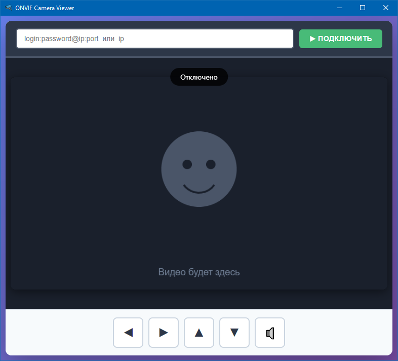

# ONVIF Camera Viewer

🎥 Простое кроссплатформенное десктопное приложение для просмотра ONVIF-камер с поддержкой PTZ-управления и звука.


---

## ✨ Возможности

-  **Подключение по ONVIF** — автоматическое получение RTSP-потока по IP-адресу камеры
-  **Видеопоток в реальном времени** — конвертация H.264/H.265 в MJPEG через FFmpeg
- 🔊 **Аудио** — воспроизведение звука с камеры (PCM 16-bit)
- 🎮 **PTZ-управление** — Pan / Tilt / Zoom через кнопки, мышь и клавиатуру
- 📝 **История подключений** — сохраняется между запусками
-  **Mute/Unmute** — кнопка отключения звука
- 🖼️ **Адаптивный интерфейс** — видео масштабируется при изменении размера окна
-  **Портативная сборка** — один `.exe` файл, не требует установки FFmpeg

---

## 🖼️ Скриншоты


*Главное окно приложения*

---

## 📋 Требования

### Для разработки:
- **Node.js** ≥ 18.x ([скачать](https://nodejs.org/))
- **npm** ≥ 9.x
- **FFmpeg** (для режима разработки) — [скачать](https://ffmpeg.org/download.html)

### Для пользователей собранного приложения:
- **Windows 10/11** (x64)
- Никаких дополнительных зависимостей — FFmpeg встроен в сборку

---

## 🚀 Установка и запуск (для разработки)

### 1. Клонировать репозиторий

```bash
git clone https://github.com/realwk/onvif-camera-viewer.git
cd onvif-camera-viewer
```

### 2. Установить зависимости

```bash
npm install
```

### 3. Запустить в режиме разработки

```bash
npm start
```

---

## 📦 Сборка приложения

### Сборка портативного EXE (один файл)

```powershell
# Windows (PowerShell)
$env:CSC_IDENTITY_AUTO_DISCOVERY="false"
npm run build:portable
```

Результат: `dist/ONVIF-Viewer.exe` — готов к запуску без установки.

### Сборка инсталлятора

```powershell
npm run build:installer
```

Результат: `dist/ONVIF-Viewer-Setup.exe`

### Сборка для Linux / macOS

```bash
npm run build:linux   # AppImage
npm run build:mac     # DMG
```

### Если скачивание Electron зависает

Используйте зеркало:

```powershell
$env:ELECTRON_MIRROR="https://npmmirror.com/mirrors/electron/"
$env:ELECTRON_BUILDER_BINARIES_MIRROR="https://npmmirror.com/mirrors/electron-builder-binaries/"
npm run build:portable
```

### Если ошибка "Cannot create symbolic link"

Запустите PowerShell **от имени администратора** или включите **Режим разработчика** в Windows (`Параметры → Обновление и безопасность → Для разработчиков`).

---

## 🎯 Использование

### Подключение к камере

В поле ввода введите адрес камеры в одном из форматов:

| Формат | Пример | Описание |
|--------|--------|----------|
| `ip` | `192.168.1.100` | Только IP (логин/пароль = `admin/admin`, порт = `80`) |
| `login:pass@ip` | `admin:secret@192.168.1.100` | С логином и паролем |
| `login:pass@ip:port` | `admin:secret@192.168.1.100:8080` | Полный формат |

Нажмите **▶ Подключить** или клавишу **Enter**.

### История подключений

- Начните вводить адрес — появится выпадающий список с предыдущими подключениями
- Выберите камеру из списка — адрес подставится автоматически
- Пункт **✕ Очистить историю** в конце списка удалит все сохранённые адреса

### Управление PTZ

#### Мышью
- Нажмите и удерживайте кнопку направления — камера движется
- Отпустите — движение останавливается

#### Клавиатурой

| Клавиша | Действие |
|---------|----------|
| `W` / `↑` | Вверх (Tilt+) |
| `S` / `↓` | Вниз (Tilt−) |
| `A` / `←` | Влево (Pan−) |
| `D` / `→` | Вправо (Pan+) |
| `+` / `=` | Zoom In |
| `-` / `_` | Zoom Out |

> Поддерживаются как английская, так и русская раскладки (ФЫВА).

### Звук

- 🔈 — звук включён
- 🔊 — звук выключен (mute)

---

## ️ Структура проекта

```
onvif-viewer/
├── assets/                  # Иконки, скриншоты
│   └── cctv-camera.ico
├── src/
│   ├── main.js              # Главный процесс Electron
│   ├── preload.js           # Preload-скрипт (мост между процессами)
│   ├── renderer.js          # Рендерер-процесс (UI)
│   ├── index.html           # HTML-разметка
│   └── styles.css           # Стили
├── package.json             # Зависимости и скрипты сборки
└── README.md
```

---

## ⚙️ Технологии

| Компонент | Назначение |
|-----------|------------|
| [Electron](https://www.electronjs.org/) | Кроссплатформенный десктоп-фреймворк |
| [onvif](https://www.npmjs.com/package/onvif) | ONVIF-протокол (получение RTSP URI, PTZ) |
| [FFmpeg](https://ffmpeg.org/) | Конвертация H.264/H.265 → MJPEG + PCM аудио |
| [ws](https://www.npmjs.com/package/ws) | WebSocket-сервер для передачи видео/аудио |
| [ffmpeg-static](https://www.npmjs.com/package/ffmpeg-static) | Встроенный FFmpeg для портативной сборки |
| [Web Audio API](https://developer.mozilla.org/docs/Web/API/Web_Audio_API) | Воспроизведение звука с AudioWorkletNode |

---

##  Известные ограничения

- **Задержка видео** — 300–800 мс из-за конвертации через FFmpeg (неизбежно для ONVIF)
- **Задержка аудио** — ~200 мс (буферизация)
- **PTZ Stop** — некоторые камеры не поддерживают команду `Stop`, поэтому используется `ContinuousMove` с нулевой скоростью
- **Формат аудио** — PCM 16-bit 8 kHz mono (качество телефонное, но стабильное)

---

## 🤝 Вклад в проект

PR приветствуются! Основные направления для улучшений:

- 📸 Скриншоты из потока
- 💾 Запись видео в файл
- 🎯 Пресеты PTZ (сохранение позиций)
- 📡 Поддержка нескольких камер одновременно
- 🔍 Цифровой зум
- 🌙 Тёмная тема

---

## 📄 Лицензия

[MIT](LICENSE) © 2026

---

##  Благодарности

- Библиотека [onvif](https://github.com/agsh/onvif) для работы с ONVIF-протоколом
- Сообщество FFmpeg за мощный инструмент конвертации
- Electron за удобный фреймворк для десктопных приложений
